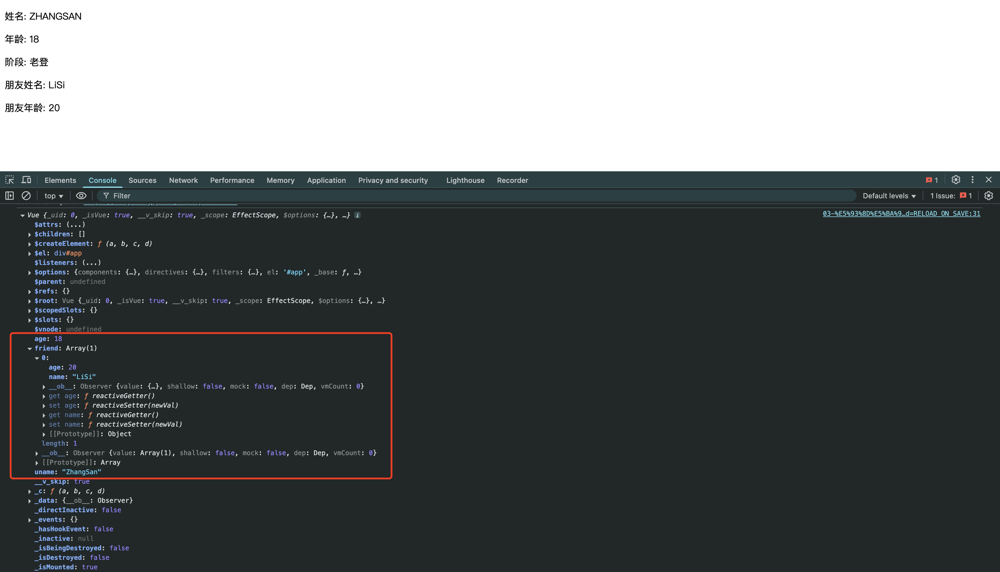

# 03-响应式特性

- 响应式: 若数据发生变化,视图(页面)会自动更新
- `Vue.$xxx`: VUE内置的属性或方法
- 我们通过`data`定义的属性,最终会定义在`Vue`实例上
- VUE的思想: **数据驱动视图**
  - 这就意味着,以后不需要考虑DOM操作(`document.querySelector.innerHTML = xxx`),只需要关心数据的变化(`vueInstance.age = xxx`)即可

- **VUE中,若响应式数据发生变化,则模板中所有依赖这个响应式数据的地方,都会被重新渲染(包括对函数的调用)**