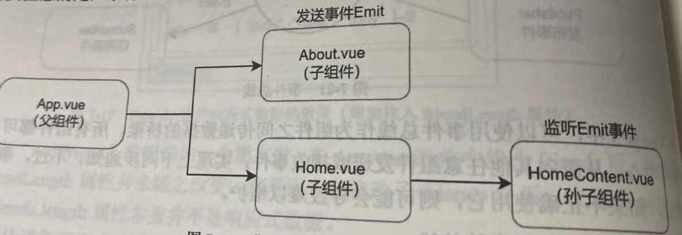

# 2-使用全局事件总线

如下图示:



- 父组件: `App.vue`
- 子组件:
  - `About.vue`
  - `Home.vue`
- 孙子组件: `Home.vue`组件中的`HomeContent.vue`组件
- `About.vue`负责触发事件
- `HomeContent.vue`负责监听事件

## 2.1 `About.vue`

```vue
<template>
    <div class="about">
        About
        <button @click="btnClick">单击按钮 触发事件</button>
    </div>
</template>

<script>
import emitter from '../utils/eventBus'
export default {
    name: 'About',
    methods: {
        btnClick() {
            console.log('1. About组件的: 单击按钮 -> 触发全局why事件')
            const param1 = {
                name: 'why',
                age: 18,
            }
            // 触发全局事件总线的why事件
            emitter.emit('why', param1)

            console.log('2. About组件的: 单击按钮 -> 触发全局kobe事件')
            const param2 = {
                name: 'kobe',
                age: 24,
            }
            // 触发全局事件总线的kobe事件
            emitter.emit('why', param2)
        },
    },
}
</script>
```

- 注意: 在`About.vue`组件中,1次点击按钮触发了两个事件
  - `why`事件
  - `kobe`事件

## 2.2 `HomeContent.vue`

```vue
<template>
    <div class="home-content">
        HomeContent
    </div>
</template>

<script>
import emitter from '../utils/eventBus'
export default {
    name: 'HomeContent',
    created() {
        // 监听全局事件总线的why事件
        emitter.on('why', (param) => {
            console.log('全局事件总线的: why事件被触发了')
            console.log(param)
            console.log('--------------------------')
        })

        // 监听全局事件总线的kobe事件
        emitter.on('kobe', (param) => {
            console.log('全局事件总线的: kobe事件被触发了')
            console.log(param)
            console.log('--------------------------')
        })

        // 监听所有事件
        emitter.on('*', (type, info) => {
            console.log('全局事件总线中监听所有事件')
            console.log('事件名:', type)
            console.log('事件参数:', info)
            console.log('--------------------------')
        })
    },
}
</script>
```

- 注意: 
  - 在`HomeContent.vue`组件中,监听事件的代码放在了`created`钩子函数中
  - 在`HomeContent.vue`组件中,不仅监听了`About.vue`组件触发的事件,还监听了所有事件

## 2.3 `Home.vue`

```vue
<template>
    <div class="home">
        Home
        <HomeContent></HomeContent>
    </div>
</template>

<script>
import HomeContent from "./HomeContent.vue"
export default {
    name: 'Home',
    components: {
        HomeContent
    },
}
</script>
```

## 2.4 `App.vue`

```vue
<template>
    <div class="app">
        <About></About>
        <Home></Home>
    </div>
</template>

<script>
import About from "./components/About.vue"
import Home from "./components/Home.vue"
export default {
    name: "App",
    components: {
        About,
        Home
    }
}
</script>
```

## 2.5 结果

- 点击按钮时,浏览器控制台打印如下:

```
1. About组件的: 单击按钮 -> 触发全局why事件
全局事件总线的: why事件被触发了
{name: 'why', age: 18}
--------------------------
全局事件总线中监听所有事件
事件名: why
事件参数: {name: 'why', age: 18}
--------------------------
2. About组件的: 单击按钮 -> 触发全局kobe事件
全局事件总线的: why事件被触发了
{name: 'kobe', age: 24}
--------------------------
全局事件总线中监听所有事件
事件名: why
事件参数: {name: 'kobe', age: 24}
--------------------------
```

- 针对每一个被监听的事件,处理时**先执行对应的事件处理函数,再执行监听所有事件的函数**