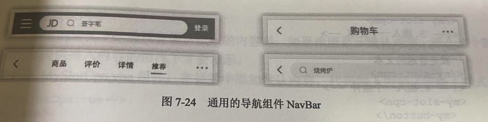

# 1-认识插槽

- 通过props传递数据的局限性:
  - 只能传递数据
  - 不能传递元素和布局

- 为了让组件更通用,需要允许组件中的内容可以被定义
- 例:
  - 在某些case下,组件展示`<button>`
  - 在其他case下,组件展示``
- 因此,组件中可变的内容应该由使用者来定义

以封装一个导航栏为例:

- 组件共3个区域:
  - 左侧
  - 中间
  - 右侧
- 这3个区域中的内容都是不固定的:
  - 左侧: 可以展示一个菜单图标/返回按钮/无内容
  - 中间: 可以展示一个搜索框/选项卡/标题
  - 右侧: 可以展示一个文字/图标/无内容
- 这个场景就需要使用插槽作为占位,让外部决定显示什么元素